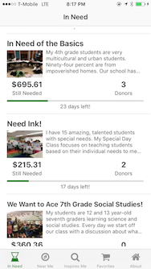
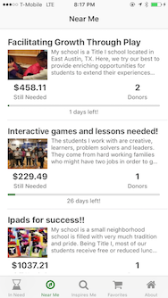
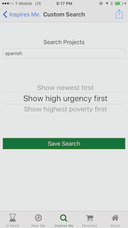
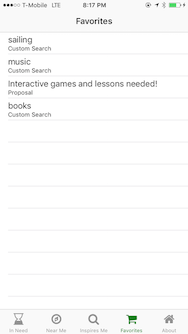

DonorsChoose Project Finder App
====

## App Strategy

Make it easy and fun to donate to school projects that matter to you on your mobile device.

Metrics that matter:

- Donations made in app: ( total, monthly, daily)
- Active devices: ( monthly, daily )
- Save/Favorite actions: projects, schools, teachers, keywords. ( monthly, daily )

## App Info

iOS Project finder app for [donorsChoose.org](http://donorsChoose.org)

Available on iTunes app store! [DonorsChoose Project Finder App](https://itunes.apple.com/us/app/donors-choose-project-finder/id1074056163?mt=8) 

## Features

DonorsChoose.org Project finder for Donors Choose donors built by Matt Schmulen to assist champions and supports of [DonorsChoose.org](http://donorsChoose.org).

Making it easy for you to find DonorsChoose.org projects, teachers and schools to support on your iPhone or iPad.

- Find teachers and students near you that are in need of your support.
- Custom search for exciting projects and subjects that inspire you!
- Save searches
- Share exciting projects with your friends

Help a DonorsChoose classroom project in need today and bring their classroom dreams to life !

## Build Requirments

- xCode 11.2.1
- Carthage
- fastlane

## Getting Started

- get the code: `git clone ` 
- install dependencies: `cd donorschoose-app/ios-donorschoose/Vendor && carthage update --no-build --no-use-binaries`
- open the XCode Project form the `donorschoose-app/ios-donorschoose` folder `open donorsChoose.xcworkspace/`
- build and run from XCode 

## Automation

Screenshots

`fastlane snapshot`

## Feedback

Please give feedback at [iTunes DonorsChoose Project Finder App](https://itunes.apple.com/us/app/donors-choose-project-finder/id1074056163?mt=8) or  [http://github.com/mschmulen/donorsChooseApp](http://github.com/mschmulen/donorsChooseApp)

## Version notes

#### Version 1.18

- swift 5 support
- xCode 11.2.1 support

#### Version 1.13

- School Details now shows projects of the School
- You can now save Schools to your Favorites so you can easily find projects associated with your favorite school
- UI updates

#### Version 1.12

- Improvements to School and Teacher detail screen

#### Version 1.11

- Open Source the core DonorsChoose Project finder iOS App! [http://github.com/mschmulen/donorsChooseApp](http://github.com/mschmulen/donorsChooseApp) pull requests and bugs reports are welcome :)
- Fix for html encoding in project synopsis
- School detail page
- General bugs fixes and improvements

#### Version 1.10

- App name changed to DonorsChoose.org Project finder
- General bugs fixes and improvements

#### Version 1.0.1

- Tab view with project listing view controller, network request to api showing keyword search results in a projectTableView
- Detail view of projects (simple webview)
- Added pull to refresh of projectTableView
- Added SearchViewController, to support simple search

## Notes

Donors Choose links:

[https://www.donorschoose.org](https://www.donorschoose.org)

[https://twitter.com/DonorsChoose](https://twitter.com/DonorsChoose)

[https://en.wikipedia.org/wiki/DonorsChoose](https://en.wikipedia.org/wiki/DonorsChoose)

[https://www.crunchbase.com/organization/donorschoose-org#/entity](https://www.crunchbase.com/organization/donorschoose-org#/entity)

[DonorsChoose.org media kit and branding notes](https://www.donorschoose.org/about/media.html)

[DonrosChoose.org Terms of service ](https://www.donorschoose.org/user-agreement)

## Release Notes:

#### Future

- (Eng) Evaluate Swift 4.2 Migration ( Consider forking or rewriting )
- (Eng) Evaluate use of LocalNotifications for watched Projects
- (Eng) Evaluate Automatic build number in based on git commit count ( possible fastlane integration )
- (Feature) iPhone XR, XS, XS-Max
- (Feature) Push via Apple CloudKit ( preserves privacy and no cost )

#### Version 1.17

- iOS12 Support ( xCode10 )
- Removed references to Fabric.io , Google Firebase as I don't think the application needs it and it adds increased questions regarding privacy and use. Why add additional complexity if the value does not contribute to the users success. 

