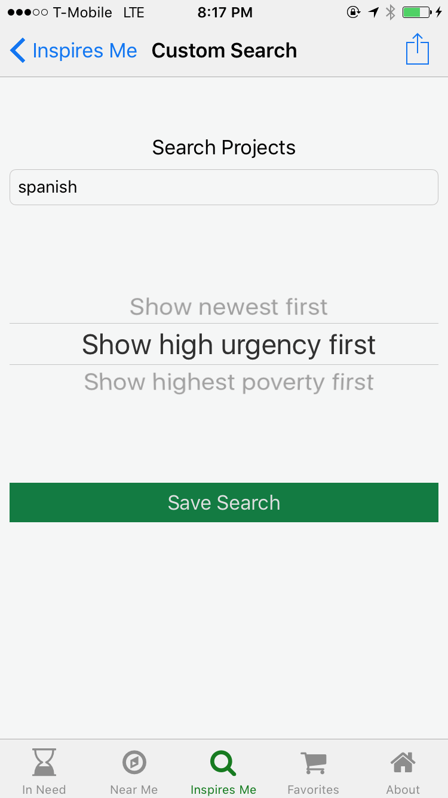

DonorsChoose Project Finder App
====

iOS Project finder app for [donorsChoose.org](http://donorsChoose.org)

Available on iTunes app store! [DonorsChoose Project Finder App](https://itunes.apple.com/us/app/donors-choose-project-finder/id1074056163?mt=8) 

[Tour Four](resources/screenshots/NearMe.png) [Tour Five](resources/screenshots/Favorites.png)

##Features

DonorsChoose.org Project finder for Donors Choose donors built by Matt Schmulen to assist champions and supports of [DonorsChoose.org](http://donorsChoose.org).

Making it easy for you to find DonorsChoose.org projects, teachers and schools to support on your iPhone or iPad.

- Find teachers and students near you that are in need of your support.
- Custom search for exciting projects and subjects that inspire you!
- Save searches
- Share exciting projects with your friends

Help a DonorsChoose classroom project in need today and bring their classroom dreams to life !

##Getting Started

- get the code: `git clone ` 
- install dependencies: `cd donorschoose-app/ios-donorschoose/Vendor && carthage update --no-build --no-use-binaries`
- open the XCode Project form the `donorschoose-app/ios-donorschoose` folder `open donorsChoose.xcworkspace/`
- build and run from XCode 

##Feedback

Please give feedback at [iTunes DonorsChoose Project Finder App](https://itunes.apple.com/us/app/donors-choose-project-finder/id1074056163?mt=8) or  [http://github.com/mschmulen/donorsChooseApp](http://github.com/mschmulen/donorsChooseApp)

##Version notes

####Version 1.11

- Open Source the core DonorsChoose Project finder iOS App! [http://github.com/mschmulen/donorsChooseApp](http://github.com/mschmulen/donorsChooseApp) pull requests and bugs are welcome :) 
- Fix for html encoding in project synopsis
- School detail page
- General bugs fixes and improvements

####Version 1.10

- App name changed to DonorsChoose.org Project finder
- General bugs fixes and improvements

####Version 1.0.1

- Tab view with project listing view controller, network request to api showing keyword search results in a projectTableView
- Detail view of projects (simple webview)
- Added pull to refresh of projectTableView
- Added SearchViewController, to support simple search

##Notes

Donors Choose links:

[https://www.donorschoose.org](https://www.donorschoose.org)

[https://twitter.com/DonorsChoose](https://twitter.com/DonorsChoose)

[https://en.wikipedia.org/wiki/DonorsChoose](https://en.wikipedia.org/wiki/DonorsChoose)

[https://www.crunchbase.com/organization/donorschoose-org#/entity](https://www.crunchbase.com/organization/donorschoose-org#/entity)

[DonorsChoose.org media kit and branding notes](https://www.donorschoose.org/about/media.html)

[DonrosChoose.org Terms of service ](https://www.donorschoose.org/user-agreement)

